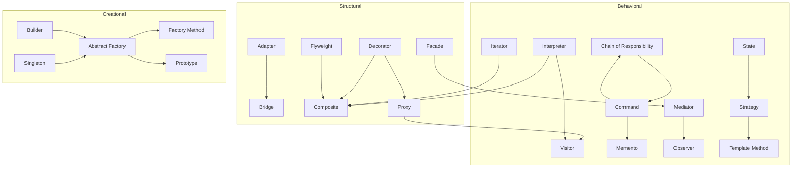

# Design Patterns in NestJS (TypeScript)

Tổng hợp 23 design patterns (Gang of Four) triển khai bằng TypeScript trong project NestJS.

---

## Creational Patterns

- [Abstract Factory](./src/creational/abstract-factory/abstract-factory.md)  
  ➡️ Khi cần tạo **một họ object liên quan** mà không phụ thuộc class cụ thể.

- [Builder](./src/creational/builder/builder.md)  
  ➡️ Khi object có **nhiều bước xây dựng phức tạp** hoặc nhiều biến thể.

- [Factory Method](./src/creational/factory-method/factory-method.md)  
  ➡️ Khi muốn **ủy quyền việc tạo object** cho subclass, thay vì gọi trực tiếp `new`.

- [Prototype](./src/creational/prototype/prototype.md)  
  ➡️ Khi muốn tạo object mới bằng cách **clone object có sẵn** thay vì tạo từ đầu.

- [Singleton](./src/creational/singleton/singleton.md)  
  ➡️ Khi cần **đảm bảo chỉ có duy nhất một instance** trong toàn hệ thống.

---

## Structural Patterns

- [Adapter](./src/structural/adapter/adapter.md)  
  ➡️ Khi cần **chuyển đổi interface** để tái sử dụng class không tương thích.

- [Bridge](./src/structural/bridge/bridge.md)  
  ➡️ Khi muốn **tách abstraction khỏi implementation**, cho phép thay đổi độc lập.

- [Composite](./src/structural/composite/composite.md)  
  ➡️ Khi cần biểu diễn cấu trúc **cây part-whole** và xử lý object đơn/lớn như nhau.

- [Decorator](./src/structural/decorator/decorator.md)  
  ➡️ Khi muốn **thêm behavior động** cho object mà không sửa class gốc.

- [Facade](./src/structural/facade/facade.md)  
  ➡️ Khi muốn cung cấp **interface đơn giản** cho subsystem phức tạp.

- [Flyweight](./src/structural/flyweight/flyweight.md)  
  ➡️ Khi cần quản lý **số lượng lớn object nhỏ** bằng cách chia sẻ dữ liệu chung.

- [Proxy](./src/structural/proxy/proxy.md)  
  ➡️ Khi cần **kiểm soát truy cập** đến object thật (lazy load, caching, logging).

---

## Behavioral Patterns

- [Chain of Responsibility](./src/behavioral/chain-of-responsibility/chain-of-responsibility.md)  
  ➡️ Khi muốn gửi request qua **chuỗi handler** cho đến khi có handler xử lý.

- [Command](./src/behavioral/command/command.md)  
  ➡️ Khi cần **đóng gói request thành object**, hỗ trợ queue, undo/redo.

- [Interpreter](./src/behavioral/interpreter/interpreter.md)  
  ➡️ Khi cần diễn dịch **ngôn ngữ đơn giản** bằng cấu trúc cây biểu thức.

- [Iterator](./src/behavioral/iterator/iterator.md)  
  ➡️ Khi cần duyệt **tuần tự collection** mà không lộ cấu trúc bên trong.

- [Mediator](./src/behavioral/mediator/mediator.md)  
  ➡️ Khi nhiều object cần giao tiếp, và muốn **giảm phụ thuộc nhiều-nhiều**.

- [Memento](./src/behavioral/memento/memento.md)  
  ➡️ Khi cần **undo/redo** hoặc snapshot trạng thái object mà không lộ nội bộ.

- [Observer](./src/behavioral/observer/observer.md)  
  ➡️ Khi cần quan hệ **một-nhiều**: thay đổi ở subject tự động notify observers.

- [State](./src/behavioral/state/state.md)  
  ➡️ Khi object có nhiều **trạng thái**, mỗi trạng thái thay đổi hành vi khác nhau.

- [Strategy](./src/behavioral/strategy/strategy.md)  
  ➡️ Khi cần thay đổi **thuật toán** runtime mà không sửa client.

- [Template Method](./src/behavioral/template-method/template-method.md)  
  ➡️ Khi nhiều class có **khung thuật toán chung** nhưng khác chi tiết.

- [Visitor](./src/behavioral/visitor/visitor.md)  
  ➡️ Khi cần thêm **operation mới** trên object mà không thay đổi class element.

---

## Relationships between Patterns

