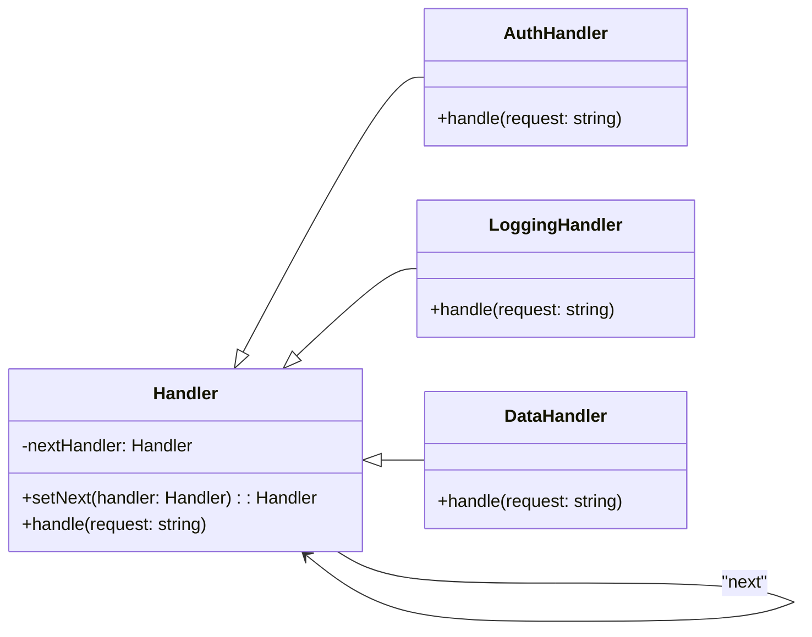

# Chain of Responsibility

## Intent

Tránh gắn chặt sender với receiver bằng cách cho phép **nhiều object có cơ hội xử lý request**. Chain of Responsibility truyền request dọc theo chain cho đến khi có handler xử lý.

## Motivation

Ví dụ hệ thống xử lý request: có `AuthHandler`, `LoggingHandler`, `DataHandler`. Thay vì client chỉ định handler cụ thể, request đi dọc chain và handler phù hợp xử lý.

## Structure

- **Handler**: Định nghĩa interface xử lý request và tham chiếu đến handler tiếp theo.
- **ConcreteHandler**: Xử lý request hoặc chuyển tiếp.
- **Client**: Gửi request đến chain.

## Participants

- `Handler` (abstract class)
- `AuthHandler`, `LoggingHandler`, `DataHandler` (Concrete Handlers)
- `Client`

## Applicability

- Khi có nhiều object có thể xử lý request.
- Khi muốn giảm sự phụ thuộc giữa sender và receiver.
- Khi muốn thay đổi chain động thời gian chạy.

## Consequences

✅ Ưu điểm:

- Giảm coupling giữa sender và receiver.
- Dễ dàng thêm/bỏ/hoán đổi handler trong chain.
- Cho phép nhiều handler xử lý request theo trình tự.

⚠️ Nhược điểm:

- Request có thể không được xử lý nếu chain không có handler phù hợp.
- Khó debug khi chain dài.

## Sample Code

Xem file [`example.ts`](./example.ts)

## Related Patterns

- **Command**: Request có thể đóng gói thành object và truyền qua chain.
- **Decorator**: Cũng wrap object, nhưng Decorator thêm behavior, còn Chain chuyển tiếp request.

## Diagram

