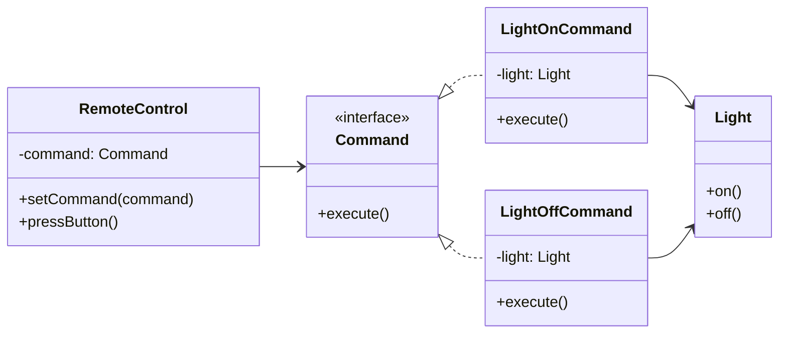

# Command

## Intent

Đóng gói một request thành object, cho phép tham số hóa client với các request, xếp hàng request, và hỗ trợ undoable operations.

## Motivation

Ví dụ `RemoteControl` có thể bật/tắt `Light`. Thay vì gọi trực tiếp, hành động được đóng gói trong `Command` object, dễ dàng mở rộng, thay thế, hoặc lưu trữ.

## Structure

- **Command**: Interface khai báo method `execute`.
- **ConcreteCommand**: Triển khai Command, gắn với Receiver.
- **Receiver**: Thực hiện logic thực sự.
- **Invoker**: Gọi Command.
- **Client**: Tạo Command và thiết lập Invoker.

## Participants

- `Command` (interface)
- `LightOnCommand`, `LightOffCommand` (Concrete Command)
- `Light` (Receiver)
- `RemoteControl` (Invoker)
- `Client`

## Applicability

- Khi muốn tách request khỏi đối tượng thực hiện.
- Khi cần undo/redo.
- Khi cần queue, log, hoặc macro command.

## Consequences

✅ Ưu điểm:

- Giảm coupling giữa Invoker và Receiver.
- Dễ mở rộng hành động mới.
- Hỗ trợ undo/redo, log, queue.

⚠️ Nhược điểm:

- Tăng số lượng class (mỗi action = 1 command).

## Sample Code

Xem file [`example.ts`](./example.ts)

## Related Patterns

- **Chain of Responsibility**: Command có thể được xử lý qua chain.
- **Memento**: Có thể kết hợp để implement undo.
- **Composite**: Macro command (command chứa nhiều command).

## Diagram

