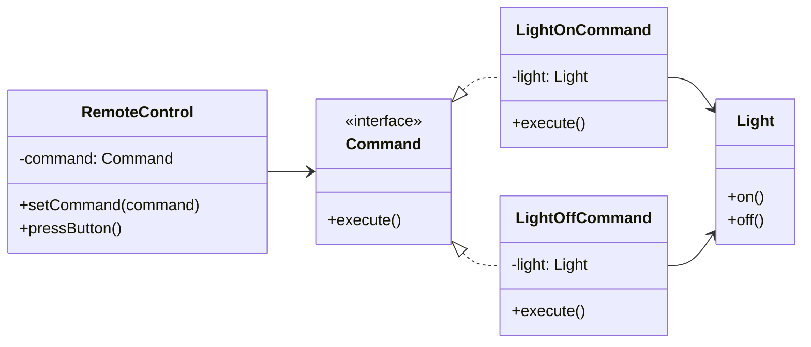

# Command

## Intent

Đóng gói một request thành object, cho phép tham số hóa client với các request, xếp hàng request, và hỗ trợ undoable operations.

## Motivation

Ví dụ `RemoteControl` có thể bật/tắt `Light`. Thay vì gọi trực tiếp, hành động được đóng gói trong `Command` object, dễ dàng mở rộng, thay thế, hoặc lưu trữ.

## Structure

- **Command**: Interface khai báo method `execute`.
- **ConcreteCommand**: Triển khai Command, gắn với Receiver.
- **Receiver**: Thực hiện logic thực sự.
- **Invoker**: Gọi Command.
- **Client**: Tạo Command và thiết lập Invoker.

## Participants

- `Command` (interface)
- `LightOnCommand`, `LightOffCommand` (Concrete Command)
- `Light` (Receiver)
- `RemoteControl` (Invoker)
- `Client`

## Applicability

- Khi muốn tách request khỏi đối tượng thực hiện.
- Khi cần undo/redo.
- Khi cần queue, log, hoặc macro command.

## Consequences

✅ Ưu điểm:

- Giảm coupling giữa Invoker và Receiver.
- Dễ mở rộng hành động mới.
- Hỗ trợ undo/redo, log, queue.

⚠️ Nhược điểm:

- Tăng số lượng class (mỗi action = 1 command).

## Sample Code

Xem file [`example.ts`](./example.ts)

## Related Patterns

- **Chain of Responsibility**: Command có thể được xử lý qua chain.
- **Memento**: Có thể kết hợp để implement undo.
- **Composite**: Macro command (command chứa nhiều command).

## Diagram

```java
public interface Command {
    boolean execute();
    void undo();
}

// Logic Thanh toán
class PaymentService {
    public boolean processPayment() {
        System.out.println("Đang thanh toán... Thành công!");
        return true; 
    }
    public void refund() {
        System.out.println("Hoàn tiền thành công.");
    }
}

// Logic Kho bãi
class InventoryService {
    public boolean reserveStock() {
        System.out.println("Đang giữ hàng trong kho... Thất bại!");
        return false; // Giả sử bước này lỗi
    }
    public void releaseStock() {
        System.out.println("Đã giải phóng hàng tồn kho.");
    }
}

class PaymentCommand implements Command {
    private PaymentService service;
    public PaymentCommand(PaymentService service) { this.service = service; }

    @Override
    public boolean execute() { return service.processPayment(); }

    @Override
    public void undo() { service.refund(); }
}

class InventoryCommand implements Command {
    private InventoryService service;
    public InventoryCommand(InventoryService service) { this.service = service; }

    @Override
    public boolean execute() { return service.reserveStock(); }

    @Override
    public void undo() { service.releaseStock(); }
}

import java.util.ArrayList;
import java.util.List;
import java.util.Stack;

public class OrderSagaOrchestrator {
    private List<Command> commands = new ArrayList<>();
    private Stack<Command> history = new Stack<>();

    public void addCommand(Command cmd) {
        commands.add(cmd);
    }

    public void execute() {
        for (Command cmd : commands) {
            if (cmd.execute()) {
                history.push(cmd);
            } else {
                System.err.println("Giao dịch thất bại. Đang kích hoạt tiến trình bù đắp (Compensating)...");
                compensate();
                return;
            }
        }
        System.out.println("Giao dịch Saga hoàn tất thành công!");
    }

    private void compensate() {
        while (!history.isEmpty()) {
            history.pop().undo();
        }
    }
}

public class Main {
    public static void main(String[] args) {
        OrderSagaOrchestrator saga = new OrderSagaOrchestrator();

        // Đăng ký các bước
        saga.addCommand(new PaymentCommand(new PaymentService()));
        saga.addCommand(new InventoryCommand(new InventoryService()));

        // Thực thi
        saga.execute();
    }
}
```


```mermaid
classDiagram
    direction LR

    class Command {
        <<interface>>
        +execute()
    }

    class Light {
        +on()
        +off()
    }

    class LightOnCommand {
        -light: Light
        +execute()
    }

    class LightOffCommand {
        -light: Light
        +execute()
    }

    class RemoteControl {
        -command: Command
        +setCommand(command)
        +pressButton()
    }

    Command <|.. LightOnCommand
    Command <|.. LightOffCommand

    LightOnCommand --> Light
    LightOffCommand --> Light

    RemoteControl --> Command
```
