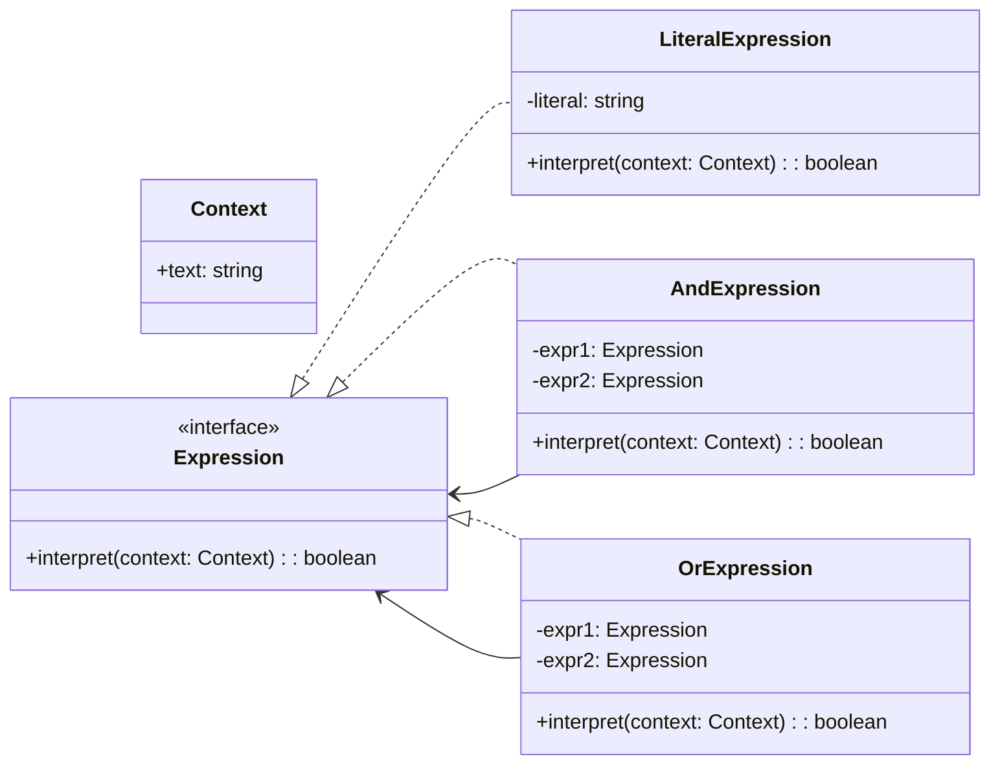

# Interpreter

## Intent

Xác định **ngữ pháp cho một ngôn ngữ đơn giản** và sử dụng các class để biểu diễn và đánh giá câu trong ngôn ngữ đó.

## Motivation

Ví dụ cần xử lý rule text: `"apple AND orange"`, `"apple OR banana"`. Interpreter cho phép định nghĩa ngữ pháp nhỏ và dùng object để đánh giá.

## Structure

- **AbstractExpression**: Interface cho tất cả expression.
- **TerminalExpression**: Biểu diễn ký hiệu cuối cùng (literal).
- **NonTerminalExpression**: Biểu diễn rule (AND, OR).
- **Context**: Chứa thông tin cần thiết để đánh giá.
- **Client**: Xây dựng câu và gọi interpret.

## Participants

- `Expression` (AbstractExpression)
- `LiteralExpression` (TerminalExpression)
- `AndExpression`, `OrExpression` (NonTerminalExpression)
- `Context`
- `Client`

## Applicability

- Khi ngôn ngữ cần diễn dịch đơn giản.
- Khi có thể biểu diễn rule bằng cấu trúc cây biểu thức.
- Khi số lượng rule thay đổi ít.

## Consequences

✅ Ưu điểm:

- Dễ mở rộng ngữ pháp mới.
- Rule được biểu diễn rõ ràng qua object.

⚠️ Nhược điểm:

- Không phù hợp với ngôn ngữ phức tạp (tree quá lớn).
- Hiệu năng thấp khi rule nhiều.

## Sample Code

Xem file [`example.ts`](./example.ts)

## Related Patterns

- **Composite**: Biểu diễn cây biểu thức.
- **Interpreter** thường dùng với **Visitor** để tách việc xử lý.

## Diagram

