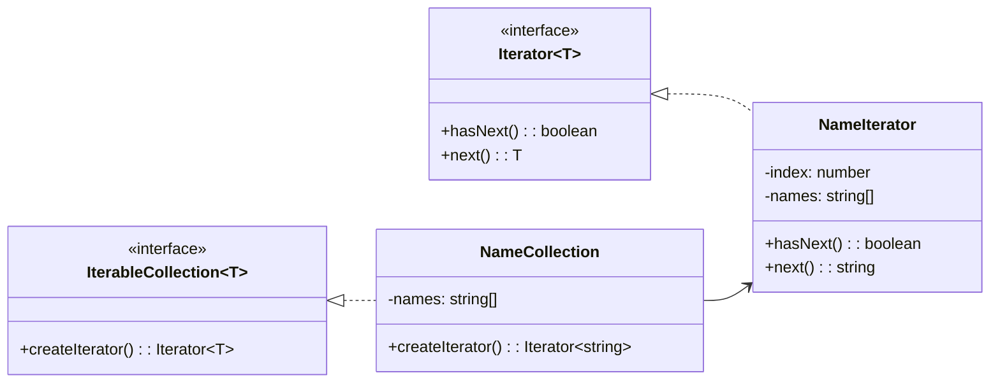

# Iterator

## Intent

Cung cấp cách truy cập tuần tự các phần tử của một collection **mà không để lộ cấu trúc bên trong**.

## Motivation

Ví dụ `NameCollection` chứa danh sách tên. Client có thể dùng `Iterator` để duyệt qua mà không cần biết cách collection được cài đặt.

## Structure

- **Iterator**: Interface duyệt phần tử.
- **ConcreteIterator**: Triển khai Iterator.
- **Aggregate (Collection)**: Interface tạo Iterator.
- **ConcreteAggregate**: Triển khai collection.
- **Client**: Sử dụng Iterator để duyệt.

## Participants

- `Iterator<T>`
- `NameIterator` (Concrete Iterator)
- `IterableCollection<T>`
- `NameCollection` (Concrete Aggregate)
- `Client`

## Applicability

- Khi cần duyệt qua collection mà không lộ cấu trúc.
- Khi muốn cung cấp nhiều cách duyệt (forward, backward).
- Khi cần tách logic duyệt ra khỏi collection.

## Consequences

✅ Ưu điểm:

- Duyệt collection đồng nhất.
- Dễ mở rộng kiểu duyệt khác nhau.
- Tách biệt collection và duyệt.

⚠️ Nhược điểm:

- Tăng số lượng class (nếu nhiều kiểu Iterator).
- Có thể gây overhead nhỏ khi đơn giản chỉ cần for loop.

## Sample Code

Xem file [`example.ts`](./example.ts)

## Related Patterns

- **Composite**: Iterator thường dùng để duyệt cây.
- **Factory Method**: Có thể dùng để tạo Iterator.

## Diagram

