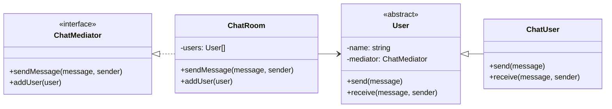

# Mediator

## Intent

Định nghĩa một object (Mediator) để **điều phối giao tiếp** giữa nhiều object khác, nhằm giảm phụ thuộc lẫn nhau.

## Motivation

Ví dụ chat room: thay vì các user gọi trực tiếp lẫn nhau, tất cả message đi qua `ChatRoom` (Mediator). Điều này giúp quản lý tốt hơn và giảm coupling.

## Structure

- **Mediator**: Interface định nghĩa giao tiếp.
- **ConcreteMediator**: Cài đặt giao tiếp và quản lý colleague.
- **Colleague**: Các class giao tiếp qua Mediator.
- **Client**: Tạo Colleague và Mediator.

## Participants

- `ChatMediator` (Mediator)
- `ChatRoom` (ConcreteMediator)
- `User` (Colleague)
- `ChatUser` (Concrete Colleague)
- `Client`

## Applicability

- Khi nhiều object cần giao tiếp phức tạp.
- Khi muốn giảm phụ thuộc nhiều-nhiều thành một-nhiều.
- Khi muốn tập trung điều phối logic giao tiếp.

## Consequences

✅ Ưu điểm:

- Giảm coupling giữa object.
- Giao tiếp tập trung, dễ quản lý.
- Dễ thay đổi hành vi giao tiếp.

⚠️ Nhược điểm:

- Mediator có thể trở thành "god object" nếu quá nhiều logic.

## Sample Code

Xem file [`example.ts`](./example.ts)

## Related Patterns

- **Observer**: Mediator có thể sử dụng Observer để broadcast.
- **Facade**: Cũng cung cấp interface chung, nhưng Mediator điều phối giữa object, còn Facade đơn giản hóa subsystem.

## Diagram

