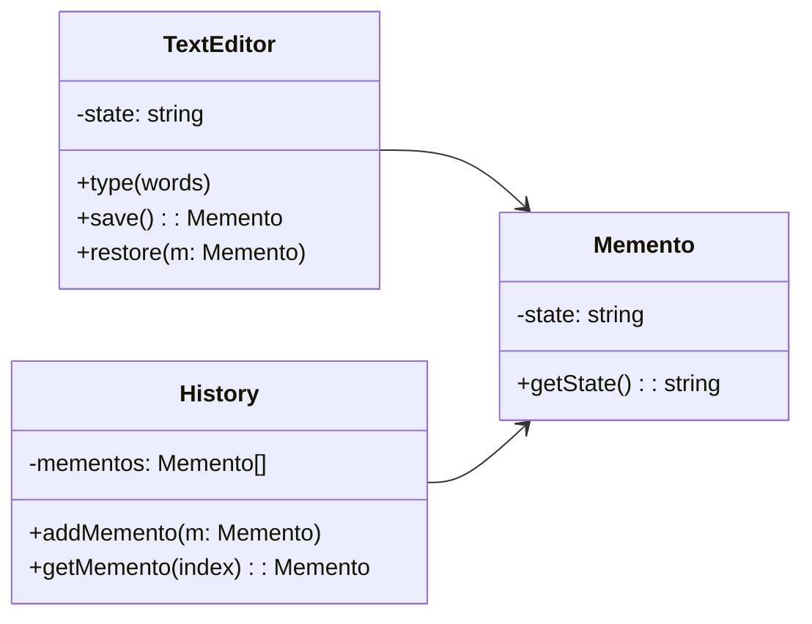

# Memento

## Intent

Cung cấp cách để **lưu trữ và khôi phục trạng thái** trước đó của object mà không vi phạm nguyên tắc đóng gói.

## Motivation

Ví dụ `TextEditor` cho phép gõ text và cần tính năng undo. Ta dùng `Memento` để lưu lại state mỗi lần và `History` để quản lý.

## Structure

- **Memento**: Lưu trữ trạng thái nội bộ.
- **Originator**: Tạo Memento và khôi phục từ Memento.
- **Caretaker**: Quản lý danh sách Memento.
- **Client**: Sử dụng Originator và Caretaker.

## Participants

- `Memento`
- `TextEditor` (Originator)
- `History` (Caretaker)
- `Client`

## Applicability

- Khi cần undo/redo.
- Khi cần snapshot của object.
- Khi muốn lưu trạng thái mà không lộ chi tiết bên trong.

## Consequences

✅ Ưu điểm:

- Hỗ trợ undo/redo dễ dàng.
- Bảo toàn tính đóng gói.

⚠️ Nhược điểm:

- Tốn bộ nhớ khi lưu nhiều memento.
- Cần cơ chế quản lý memento hiệu quả.

## Sample Code

Xem file [`example.ts`](./example.ts)

## Related Patterns

- **Command**: Có thể kết hợp với Memento để hỗ trợ undo.
- **Prototype**: Có thể dùng clone thay cho memento trong một số trường hợp.

## Diagram

