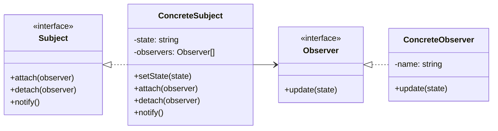

# Observer

## Intent

Xác định quan hệ **một-nhiều** giữa các object: khi một object thay đổi trạng thái, tất cả các object phụ thuộc sẽ được thông báo và cập nhật tự động.

## Motivation

Ví dụ `ConcreteSubject` có nhiều `Observer`. Khi subject thay đổi trạng thái, nó tự động gọi `update` cho các observer.

## Structure

- **Subject**: Giữ danh sách observer, có method attach/detach/notify.
- **Observer**: Interface nhận thông báo.
- **ConcreteSubject**: Triển khai Subject, giữ trạng thái.
- **ConcreteObserver**: Triển khai Observer, cập nhật khi notify.
- **Client**: Gắn observer với subject.

## Participants

- `Subject`
- `Observer`
- `ConcreteSubject`
- `ConcreteObserver`
- `Client`

## Applicability

- Khi một object thay đổi thì nhiều object khác cần cập nhật.
- Khi cần tách biệt subject và observer để dễ mở rộng.
- Khi muốn thực hiện event-driven.

## Consequences

✅ Ưu điểm:

- Giảm coupling giữa subject và observer.
- Dễ thêm observer mới mà không cần sửa subject.
- Hỗ trợ broadcast tự nhiên.

⚠️ Nhược điểm:

- Có thể gây update dây chuyền ngoài ý muốn.
- Observer có thể bị gọi nhiều lần không cần thiết.

## Sample Code

Xem file [`example.ts`](./example.ts)

## Related Patterns

- **Mediator**: Điều phối nhiều object, nhưng tập trung vào điều khiển hơn là publish-subscribe.
- **Event Bus**: Là biến thể mở rộng của Observer trong hệ thống lớn.

## Diagram

