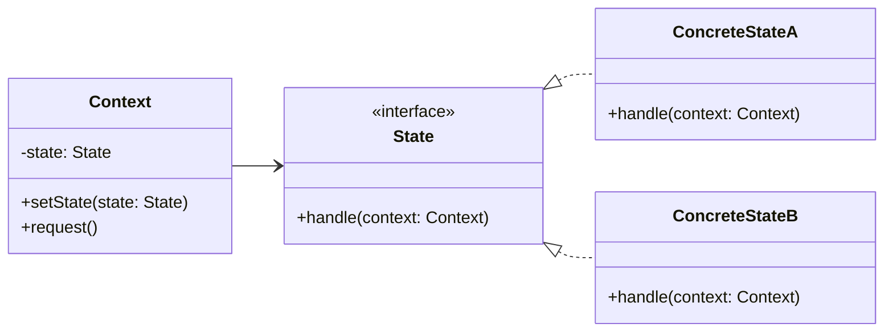

# State

## Intent

Cho phép object thay đổi hành vi khi trạng thái nội bộ thay đổi. Nhìn từ ngoài, object như thể thay đổi class của nó.

## Motivation

Ví dụ máy trạng thái (state machine): `Context` có thể ở `StateA` hoặc `StateB`. Khi `request`, behavior phụ thuộc vào state hiện tại và có thể chuyển sang state khác.

## Structure

- **State**: Interface khai báo hành vi theo state.
- **ConcreteState**: Triển khai behavior cho từng state.
- **Context**: Giữ tham chiếu đến State hiện tại, ủy thác behavior cho state.

## Participants

- `State` (interface)
- `ConcreteStateA`, `ConcreteStateB`
- `Context`
- `Client`

## Applicability

- Khi hành vi object thay đổi tùy theo state.
- Khi cần giảm các câu lệnh điều kiện phức tạp.
- Khi muốn tách logic state ra khỏi context.

## Consequences

✅ Ưu điểm:

- Giảm câu lệnh điều kiện if/else phức tạp.
- Dễ thêm state mới.
- Behavior tách biệt, dễ bảo trì.

⚠️ Nhược điểm:

- Tăng số lượng class.
- Context phải biết các state để khởi tạo.

## Sample Code

Xem file [`example.ts`](./example.ts)

## Related Patterns

- **Strategy**: Cả hai đều đóng gói behavior, nhưng State tự thay đổi nội tại, còn Strategy do client chọn.
- **Flyweight**: Có thể chia sẻ state object nếu chúng không giữ dữ liệu riêng.

## Diagram

