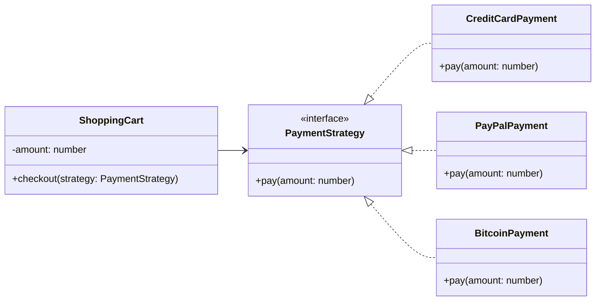

# Strategy

## Intent

Định nghĩa một họ thuật toán, đóng gói từng thuật toán, và làm cho chúng có thể thay thế lẫn nhau. Strategy cho phép thuật toán thay đổi độc lập với client sử dụng.

## Motivation

Ví dụ `ShoppingCart` cần thanh toán. Thay vì hardcode `CreditCard` hay `PayPal`, client có thể chọn Strategy thanh toán tại runtime.

## Structure

- **Strategy**: Interface định nghĩa thuật toán.
- **ConcreteStrategy**: Cài đặt cụ thể.
- **Context**: Sử dụng Strategy để thực hiện công việc.
- **Client**: Chọn Strategy.

## Participants

- `PaymentStrategy` (Strategy)
- `CreditCardPayment`, `PayPalPayment`, `BitcoinPayment` (Concrete Strategy)
- `ShoppingCart` (Context)
- `Client`

## Applicability

- Khi cần nhiều thuật toán thay thế nhau.
- Khi muốn tránh nhiều câu lệnh điều kiện if/else.
- Khi muốn tách biệt behavior thay đổi khỏi client.

## Consequences

✅ Ưu điểm:

- Dễ thêm thuật toán mới mà không cần sửa client.
- Tuân thủ OCP, DIP.
- Cho phép chọn behavior tại runtime.

⚠️ Nhược điểm:

- Tăng số lượng class.
- Client phải biết để chọn Strategy phù hợp.

## Sample Code

Xem file [`example.ts`](./example.ts)

## Related Patterns

- **State**: Cả hai đều đóng gói behavior. Strategy do client chọn, còn State tự thay đổi bên trong Context.
- **Decorator**: Có thể kết hợp để mở rộng Strategy.

## Diagram

