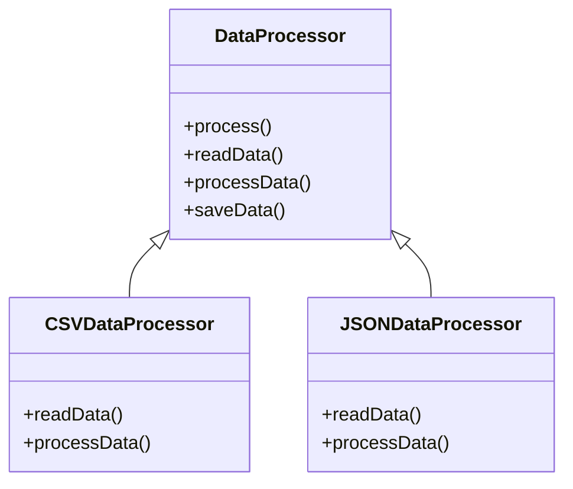

# Template Method

## Intent

Xác định **bộ khung (skeleton)** của một thuật toán trong một operation, để các subclass có thể định nghĩa các bước cụ thể mà không thay đổi cấu trúc tổng thể.

## Motivation

Ví dụ xử lý dữ liệu: mọi format (CSV, JSON) đều có bước đọc, xử lý, lưu. Thay vì lặp lại logic, ta định nghĩa `process()` trong abstract class và để subclass định nghĩa chi tiết.

## Structure

- **AbstractClass**: Định nghĩa template method chứa các bước. Một số bước có thể abstract, subclass phải cài đặt.
- **ConcreteClass**: Cài đặt các bước cụ thể.
- **Client**: Gọi template method.

## Participants

- `DataProcessor` (AbstractClass)
- `CSVDataProcessor`, `JSONDataProcessor` (ConcreteClass)
- `Client`

## Applicability

- Khi nhiều class có chung bộ khung thuật toán.
- Khi muốn tái sử dụng code chung và chỉ thay đổi chi tiết từng bước.
- Khi muốn kiểm soát trình tự thực hiện.

## Consequences

✅ Ưu điểm:

- Tái sử dụng code.
- Dễ mở rộng chi tiết mà không ảnh hưởng bộ khung.
- Tuân thủ OCP.

⚠️ Nhược điểm:

- Tăng số lượng subclass.
- Khó hiểu hơn nếu có nhiều hook/step abstract.

## Sample Code

Xem file [`example.ts`](./example.ts)

## Related Patterns

- **Strategy**: Cũng thay thế thuật toán, nhưng Strategy thay toàn bộ bằng object ngoài; Template Method thay đổi một số bước trong subclass.
- **Factory Method**: Thường được dùng như step trong Template Method.

## Diagram

