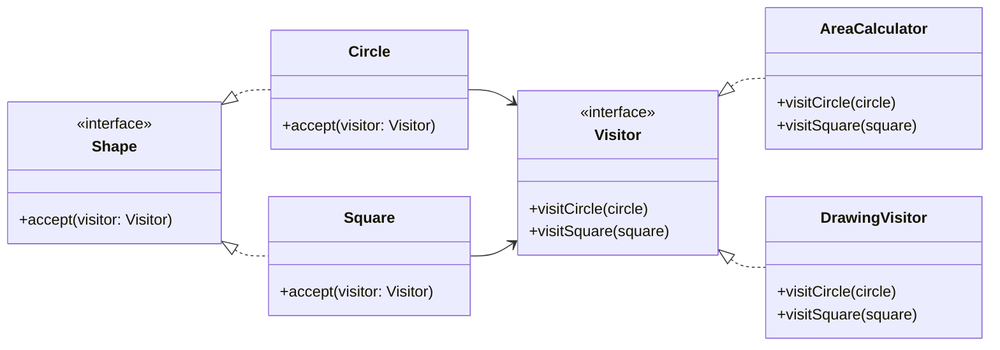

# Visitor

## Intent

Định nghĩa một operation mới trên cấu trúc object mà **không thay đổi class** của các element trong cấu trúc đó.

## Motivation

Ví dụ có `Circle`, `Square`. Nếu muốn thêm behavior (tính diện tích, vẽ), thay vì chỉnh sửa class element, ta dùng `Visitor` để tách riêng behavior.

## Structure

- **Visitor**: Định nghĩa operation cho từng loại Element.
- **ConcreteVisitor**: Cài đặt operation cụ thể.
- **Element**: Interface có method `accept`.
- **ConcreteElement**: Triển khai `accept`, gọi lại Visitor.
- **Client**: Duyệt element và gọi visitor.

## Participants

- `Visitor`
- `AreaCalculator`, `DrawingVisitor` (ConcreteVisitor)
- `Shape` (Element)
- `Circle`, `Square` (ConcreteElement)
- `Client`

## Applicability

- Khi cần thêm operation mới cho cấu trúc object ổn định.
- Khi muốn gom logic liên quan thành class Visitor.
- Khi class element ít thay đổi, nhưng operation thường xuyên thay đổi.

## Consequences

✅ Ưu điểm:

- Dễ thêm operation mới.
- Gom logic chung vào Visitor.
- Tuân thủ Open/Closed.

⚠️ Nhược điểm:

- Khó thêm loại Element mới (phải sửa tất cả Visitor).
- Có thể vi phạm encapsulation nếu Visitor cần truy cập nội bộ Element.

## Sample Code

Xem file [`example.ts`](./example.ts)

## Related Patterns

- **Composite**: Visitor thường dùng để duyệt cây Composite.
- **Interpreter**: Visitor có thể dùng để đánh giá cấu trúc ngữ pháp.

## Diagram

