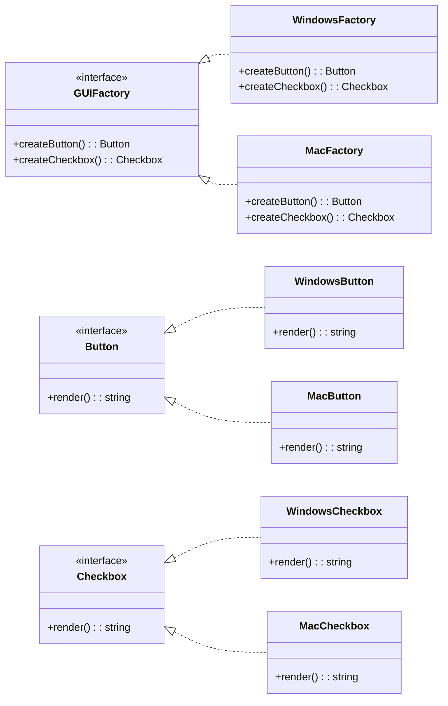

# Abstract Factory

## Intent

Cung cấp interface để tạo ra **một họ các đối tượng liên quan** mà không cần chỉ định class cụ thể.

## Motivation

Trong ứng dụng UI, bạn cần render component theo hệ điều hành khác nhau (Windows, MacOS). Abstract Factory cho phép tạo ra các object tương ứng mà client code không cần biết class cụ thể.

## Structure

- **Abstract Factory**: Khai báo các phương thức tạo sản phẩm.
- **Concrete Factory**: Cài đặt phương thức để tạo ra sản phẩm cụ thể.
- **Abstract Product**: Interface cho sản phẩm.
- **Concrete Product**: Triển khai cụ thể của sản phẩm.
- **Client**: Sử dụng factory để tạo object.

## Participants

- `GUIFactory` (Abstract Factory)
- `WindowsFactory`, `MacFactory` (Concrete Factory)
- `Button`, `Checkbox` (Abstract Product)
- `WindowsButton`, `MacButton`, `WindowsCheckbox`, `MacCheckbox` (Concrete Product)
- `Application` (Client)

## Applicability

- Khi hệ thống cần làm việc với nhiều họ sản phẩm liên quan.
- Khi muốn đảm bảo sự tương thích giữa các sản phẩm cùng họ.

## Consequences

✅ Ưu điểm:

- Cách ly client khỏi class cụ thể.
- Đảm bảo tính tương thích giữa các object cùng họ.
- Dễ dàng mở rộng thêm họ sản phẩm mới.

⚠️ Nhược điểm:

- Khó mở rộng khi muốn thêm một loại sản phẩm mới.

## Sample Code

Xem file [`example.ts`](./example.ts)

## Related Patterns

- **Factory Method**: Abstract Factory thường triển khai các phương thức bằng Factory Method.
- **Prototype**: Có thể dùng để thay thế Abstract Factory khi cần clone object.

## Diagram

