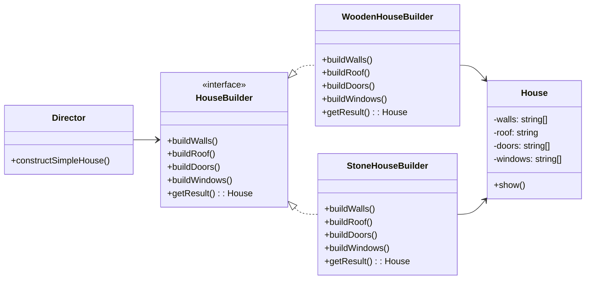

# Builder

## Intent

Tách biệt quá trình xây dựng một object phức tạp khỏi biểu diễn của nó, nhờ đó cùng một quá trình xây dựng có thể tạo ra nhiều biểu diễn khác nhau.

## Motivation

Khi một object có nhiều bước khởi tạo phức tạp (ví dụ: xây dựng một ngôi nhà có nhiều phần tường, mái, cửa, cửa sổ…), Builder giúp cô lập logic xây dựng khỏi client.

## Structure

- **Builder**: Khai báo các bước tạo sản phẩm.
- **Concrete Builder**: Triển khai từng bước cụ thể.
- **Product**: Đối tượng phức tạp được tạo ra.
- **Director**: Điều phối việc xây dựng theo một trình tự.
- **Client**: Chỉ định Builder, yêu cầu Director xây dựng.

## Participants

- `HouseBuilder` (Builder)
- `WoodenHouseBuilder`, `StoneHouseBuilder` (Concrete Builder)
- `House` (Product)
- `Director` (Director)
- `Client`

## Applicability

- Khi object có nhiều bước xây dựng phức tạp.
- Khi cần tạo ra nhiều biến thể khác nhau của cùng một object.
- Khi cần kiểm soát quá trình khởi tạo chi tiết từ bên ngoài.

## Consequences

✅ Ưu điểm:

- Tách biệt construction logic khỏi representation.
- Dễ dàng thay đổi cách tạo object phức tạp.
- Có thể tái sử dụng cùng một quá trình xây dựng cho nhiều biểu diễn khác nhau.

⚠️ Nhược điểm:

- Tăng số lượng class trong hệ thống.

## Sample Code

Xem file [`example.ts`](./example.ts)

## Related Patterns

- **Abstract Factory**: Cùng tạo object phức tạp, nhưng Abstract Factory tập trung vào _họ các object liên quan_, Builder tập trung vào _quy trình xây dựng_.
- **Composite**: Thường dùng chung khi product có cấu trúc phân cấp.

## Diagram

