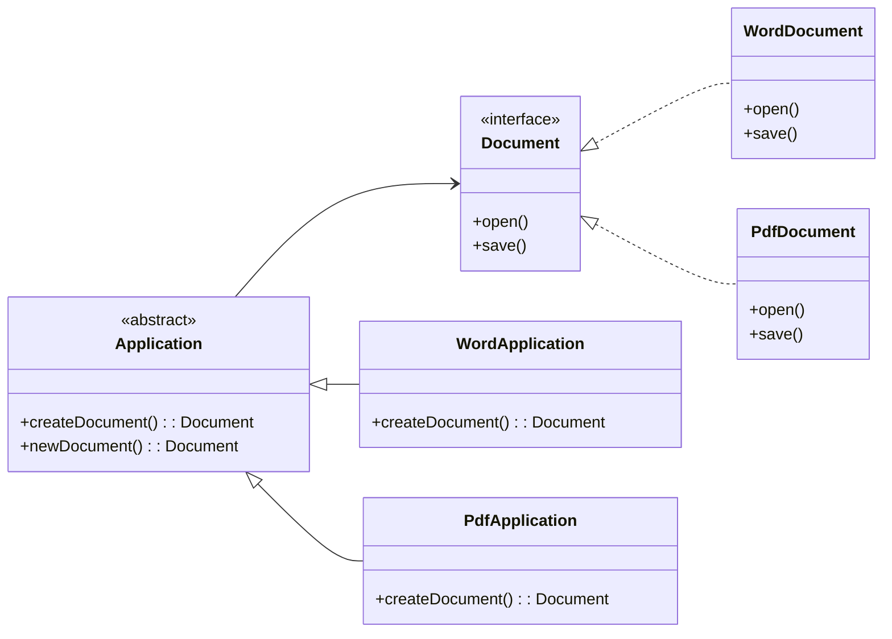

# Factory Method

## Intent

Định nghĩa một interface để tạo object, nhưng cho phép các subclass quyết định class nào được tạo. Factory Method cho phép defer việc khởi tạo xuống subclass.

## Motivation

Trong ứng dụng xử lý văn bản, bạn có thể muốn tạo nhiều loại tài liệu khác nhau (Word, PDF). Thay vì hard-code logic tạo object, ta định nghĩa Factory Method để subclass quyết định object nào cần tạo.

## Structure

- **Product**: Interface chung cho các đối tượng sẽ được tạo.
- **Concrete Product**: Cài đặt cụ thể của Product.
- **Creator (Application)**: Khai báo Factory Method trả về một Product.
- **Concrete Creator**: Override Factory Method để trả về Product cụ thể.

## Participants

- `Document` (Product)
- `WordDocument`, `PdfDocument` (Concrete Product)
- `Application` (Creator)
- `WordApplication`, `PdfApplication` (Concrete Creator)
- `Client`

## Applicability

- Khi một class không thể biết trước chính xác loại object nó phải tạo.
- Khi muốn để cho subclass quyết định loại object nào cần tạo.
- Khi muốn code client làm việc với interface chứ không phụ thuộc vào class cụ thể.

## Consequences

✅ Ưu điểm:

- Loại bỏ sự phụ thuộc vào class cụ thể trong code client.
- Dễ dàng mở rộng thêm loại sản phẩm mới bằng cách tạo subclass mới.

⚠️ Nhược điểm:

- Tăng số lượng subclass trong hệ thống.
- Đôi khi có thể dẫn đến code phức tạp hơn cần thiết.

## Sample Code

Xem file [`example.ts`](./example.ts)

## Related Patterns

- **Abstract Factory**: Thường triển khai bằng nhiều Factory Method.
- **Template Method**: Factory Method thực chất là một trường hợp đặc biệt của Template Method.

## Diagram

