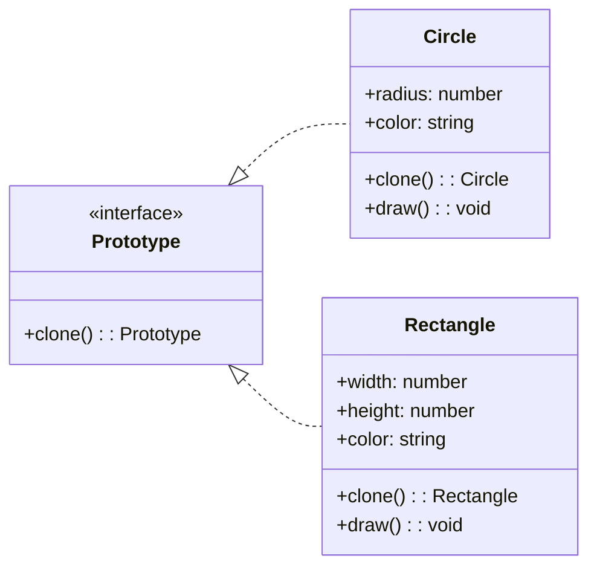

# Prototype

## Intent

Dùng để **tạo object bằng cách copy (clone)** một object có sẵn thay vì tạo mới từ đầu.

## Motivation

Khi việc khởi tạo object tốn kém (nhiều cấu hình, dữ liệu phức tạp), thay vì tạo mới hoàn toàn, ta có thể clone một object có sẵn và thay đổi nếu cần.

## Structure

- **Prototype**: Khai báo phương thức `clone`.
- **Concrete Prototype**: Cài đặt clone để trả về bản sao của chính nó.
- **Client**: Sử dụng Prototype để tạo object mới.

## Participants

- `Prototype<T>` (Prototype)
- `Circle`, `Rectangle` (Concrete Prototype)
- `Client`

## Applicability

- Khi việc khởi tạo object phức tạp, tốn chi phí.
- Khi muốn clone object thay vì tạo mới từ đầu.
- Khi muốn client code độc lập với logic khởi tạo object.

## Consequences

✅ Ưu điểm:

- Giảm chi phí khởi tạo object phức tạp.
- Dễ dàng thêm hoặc thay đổi object runtime.
- Loại bỏ sự phụ thuộc vào class cụ thể.

⚠️ Nhược điểm:

- Cần implement clone cho từng class.
- Nếu object chứa tham chiếu phức tạp (deep copy) thì phải cẩn thận.

## Sample Code

Xem file [`example.ts`](./example.ts)

## Related Patterns

- **Abstract Factory**: Có thể dùng Prototype thay thế Abstract Factory để tạo object từ mẫu có sẵn.
- **Composite**: Các node trong cây Composite thường hỗ trợ clone.

## Diagram

