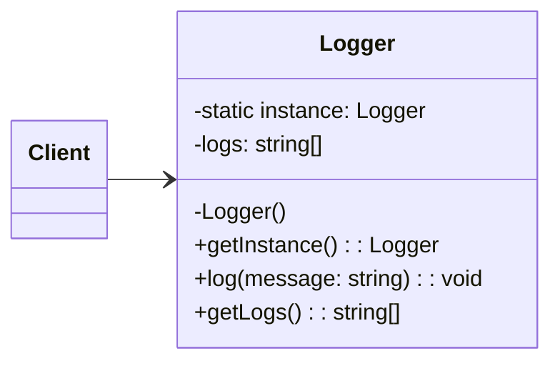

# Singleton

## Intent

Đảm bảo rằng một class chỉ có duy nhất **một instance** và cung cấp một điểm truy cập toàn cục (global access point) tới instance đó.

## Motivation

Trong hệ thống, đôi khi cần một đối tượng duy nhất để quản lý trạng thái chung, ví dụ: Logger, Configuration, Connection Pool. Singleton đảm bảo chỉ tồn tại duy nhất một instance.

## Structure

- **Singleton**: Class tự quản lý việc khởi tạo và đảm bảo chỉ có một instance tồn tại.

## Participants

- `Logger` (Singleton)
- `Client`

## Applicability

- Khi cần duy nhất một instance trong toàn hệ thống.
- Khi muốn cung cấp một điểm truy cập toàn cục đến object.
- Khi muốn kiểm soát số lượng instance.

## Consequences

✅ Ưu điểm:

- Đảm bảo chỉ có một instance.
- Truy cập toàn cục dễ dàng.
- Tiết kiệm tài nguyên khi instance tốn chi phí tạo.

⚠️ Nhược điểm:

- Có thể làm code khó test (khó mock).
- Nếu lạm dụng có thể dẫn đến thiết kế kém.
- Dễ vi phạm nguyên tắc Single Responsibility.

## Sample Code

Xem file [`example.ts`](./example.ts)

## Related Patterns

- **Abstract Factory**, **Builder**, **Prototype**: Thường dùng Singleton để triển khai Factory khi chỉ cần một instance duy nhất.
- **Facade**: Có thể kết hợp với Singleton để cung cấp một entry point duy nhất cho subsystem.

## Diagram

