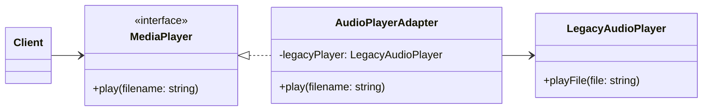

# Adapter

## Intent

Chuyển đổi interface của một class thành interface mà client mong đợi. Adapter cho phép các class có interface không tương thích làm việc với nhau.

## Motivation

Bạn có một hệ thống MediaPlayer mong đợi interface `play(filename)`, nhưng một thư viện cũ (`LegacyAudioPlayer`) chỉ có `playFile(file)`. Thay vì sửa code thư viện, ta viết một Adapter để client có thể dùng trực tiếp.

## Structure

- **Target**: Interface mà client mong đợi.
- **Adaptee**: Class hiện tại có interface không tương thích.
- **Adapter**: Chuyển đổi request từ Target sang Adaptee.
- **Client**: Sử dụng Target interface.

## Participants

- `MediaPlayer` (Target)
- `LegacyAudioPlayer` (Adaptee)
- `AudioPlayerAdapter` (Adapter)
- `Client`

## Applicability

- Khi cần sử dụng một class có sẵn nhưng interface không khớp với yêu cầu của client.
- Khi muốn tái sử dụng class mà không cần chỉnh sửa code gốc.

## Consequences

✅ Ưu điểm:

- Giúp tái sử dụng code cũ.
- Giữ cho client code độc lập với class cụ thể.
- Giảm thiểu việc thay đổi hệ thống có sẵn.

⚠️ Nhược điểm:

- Có thể làm tăng độ phức tạp khi phải viết nhiều Adapter.
- Có thể gây giảm hiệu năng nhẹ (nếu gọi lồng nhiều adapter).

## Sample Code

Xem file [`example.ts`](./example.ts)

## Related Patterns

- **Bridge**: Cũng giải quyết vấn đề interface khác nhau, nhưng Bridge tập trung tách abstraction khỏi implementation.
- **Decorator**: Cũng wrap object, nhưng mục đích thêm behavior chứ không thay đổi interface.

## Diagram

