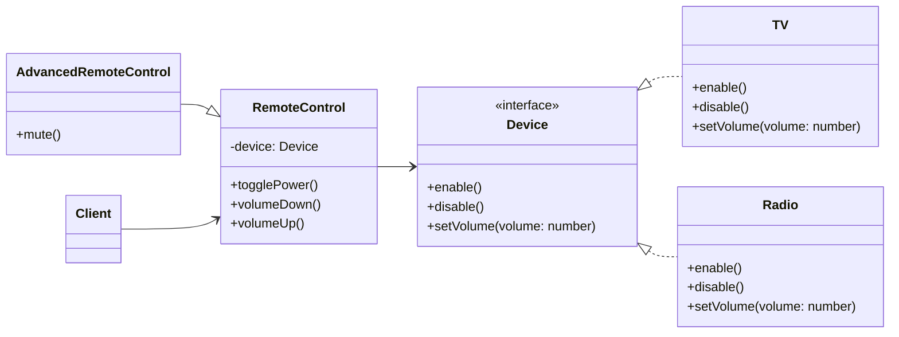

# Bridge

## Intent

Tách abstraction (RemoteControl) khỏi implementation (Device), cho phép chúng có thể thay đổi độc lập.

## Motivation

Khi có nhiều biến thể abstraction và nhiều biến thể implementation, nếu kết hợp trực tiếp sẽ tạo ra nhiều class. Bridge pattern giúp giảm số lượng class bằng cách tách abstraction và implementation thành hai hệ thống độc lập có thể kết hợp tự do.

## Structure

- **Abstraction**: Định nghĩa interface cấp cao, tham chiếu đến Implementor.
- **Refined Abstraction**: Mở rộng Abstraction.
- **Implementor**: Định nghĩa interface cho implementation.
- **Concrete Implementor**: Cài đặt cụ thể cho Implementor.
- **Client**: Sử dụng abstraction.

## Participants

- `Device` (Implementor)
- `TV`, `Radio` (Concrete Implementor)
- `RemoteControl` (Abstraction)
- `AdvancedRemoteControl` (Refined Abstraction)
- `Client`

## Applicability

- Khi muốn tránh sự kết hợp trực tiếp giữa abstraction và implementation.
- Khi cần mở rộng abstraction và implementation độc lập.
- Khi có nhiều biến thể abstraction và implementation.

## Consequences

✅ Ưu điểm:

- Giảm số lượng class kết hợp.
- Dễ mở rộng abstraction và implementation độc lập.
- Giữ code linh hoạt và dễ bảo trì.

⚠️ Nhược điểm:

- Tăng độ phức tạp (nhiều lớp hơn).
- Đôi khi abstraction và implementation quá đơn giản thì không cần thiết.

## Sample Code

Xem file [`example.ts`](./example.ts)

## Related Patterns

- **Adapter**: Cũng làm việc với interface khác nhau, nhưng mục đích khác (tương thích thay vì tách rời abstraction/implementation).
- **Abstract Factory**: Có thể dùng để tạo ra các Implementor.

## Diagram

