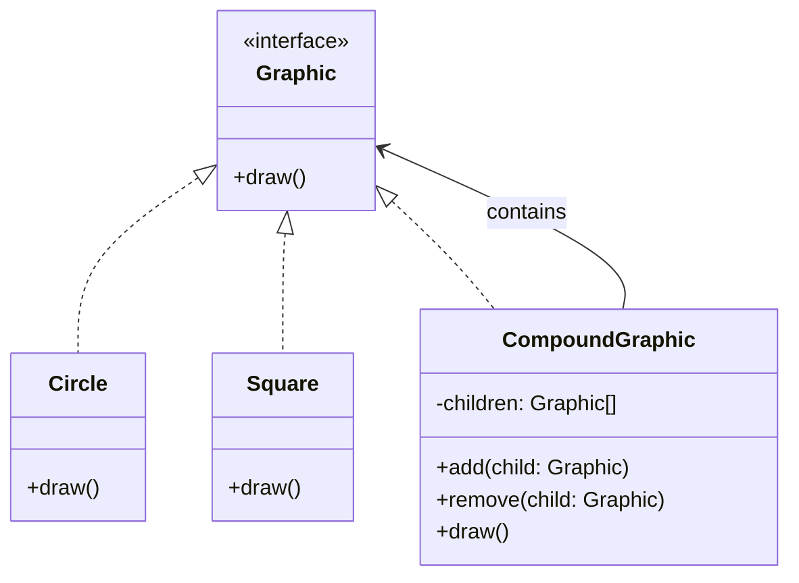

# Composite

## Intent

Tổ chức các object theo cấu trúc cây để biểu diễn hệ thống phân cấp **"phần-tổng thể"** (part-whole). Composite cho phép client xử lý object đơn lẻ và tập hợp object một cách đồng nhất.

## Motivation

Ví dụ với ứng dụng đồ họa: một `Circle` và `Square` có thể vẽ riêng lẻ, hoặc nhóm lại thành `CompoundGraphic` để vẽ cùng lúc. Composite cho phép xử lý như thể tất cả đều là `Graphic`.

## Structure

- **Component**: Interface chung cho tất cả object trong cấu trúc.
- **Leaf**: Object cuối cùng, không chứa child.
- **Composite**: Chứa child và triển khai xử lý đồng thời.
- **Client**: Làm việc với Component mà không quan tâm nó là Leaf hay Composite.

## Participants

- `Graphic` (Component)
- `Circle`, `Square` (Leaf)
- `CompoundGraphic` (Composite)
- `Client`

## Applicability

- Khi cần biểu diễn cấu trúc cây part-whole.
- Khi muốn client xử lý object đơn và tập hợp đồng nhất.
- Khi muốn dễ dàng thêm node mới mà không thay đổi client code.

## Consequences

✅ Ưu điểm:

- Đơn giản hóa code client.
- Dễ mở rộng thêm Leaf/Composite mới.
- Cho phép cấu trúc đệ quy linh hoạt.

⚠️ Nhược điểm:

- Khó kiểm soát các operation với Component chung.
- Có thể khiến thiết kế trở nên quá tổng quát.

## Sample Code

Xem file [`example.ts`](./example.ts)

## Related Patterns

- **Decorator**: Cũng wrap object, nhưng để thêm behavior động thay vì cấu trúc cây.
- **Flyweight**: Có thể dùng trong Leaf để tối ưu bộ nhớ.

## Diagram

