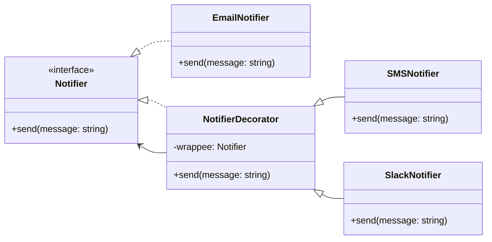

# Decorator

## Intent

Gắn thêm trách nhiệm (responsibility) cho object **mà không cần thay đổi code class gốc**. Decorator cung cấp cách linh hoạt để mở rộng chức năng runtime.

## Motivation

Ví dụ hệ thống thông báo: ban đầu chỉ cần `EmailNotifier`. Sau này muốn thêm SMS, Slack. Thay vì sửa code `EmailNotifier`, ta dùng Decorator để bọc (wrap) và thêm behavior.

## Structure

- **Component**: Interface chung.
- **Concrete Component**: Triển khai cơ bản.
- **Decorator**: Base class giữ tham chiếu đến Component.
- **Concrete Decorator**: Thêm behavior trước/hoặc sau khi gọi Component gốc.
- **Client**: Kết hợp Decorator để tạo object với behavior mở rộng.

## Participants

- `Notifier` (Component)
- `EmailNotifier` (Concrete Component)
- `NotifierDecorator` (Decorator)
- `SMSNotifier`, `SlackNotifier` (Concrete Decorator)
- `Client`

## Applicability

- Khi cần thêm behavior động mà không muốn sửa code class gốc.
- Khi cần kết hợp nhiều behavior khác nhau runtime.
- Khi muốn thay thế kế thừa bằng composition.

## Consequences

✅ Ưu điểm:

- Mở rộng behavior linh hoạt runtime.
- Tránh tạo nhiều subclass cho từng biến thể.
- Tuân thủ nguyên lý Open/Closed.

⚠️ Nhược điểm:

- Tăng số lượng object khi nhiều decorator lồng nhau.
- Debug khó hơn do call stack phức tạp.

## Sample Code

Xem file [`example.ts`](./example.ts)

## Related Patterns

- **Composite**: Cũng dùng composition, nhưng để biểu diễn cấu trúc cây, không phải thêm behavior.
- **Adapter**: Cũng wrap object, nhưng mục đích thay đổi interface.

## Diagram

