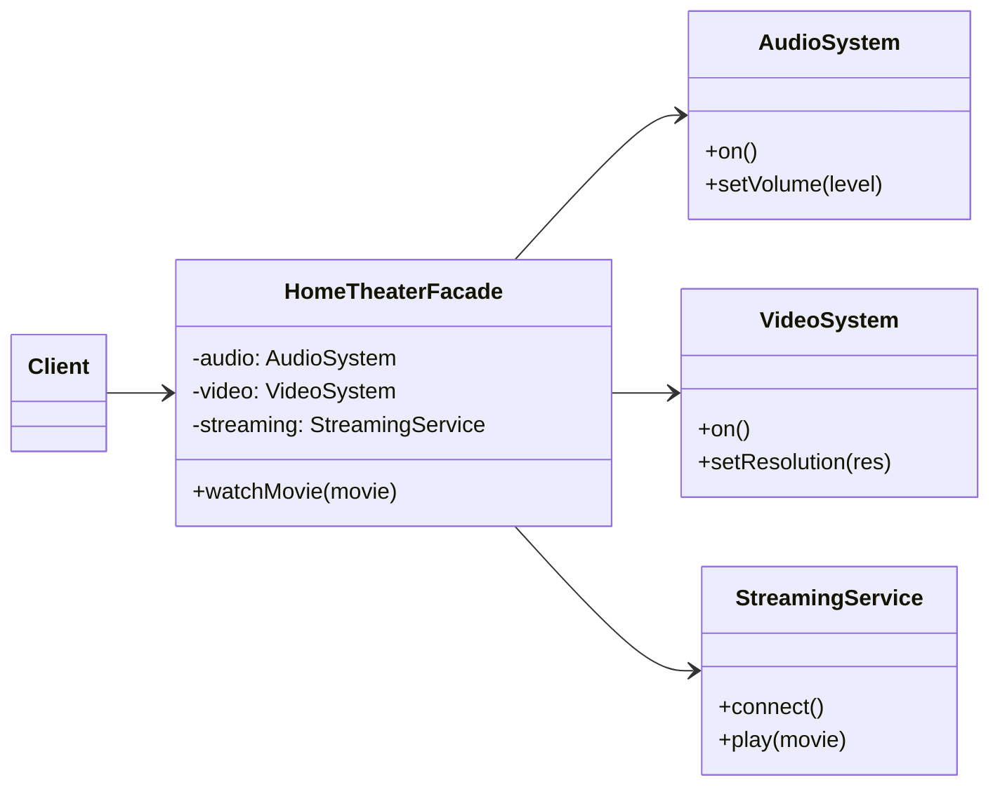

# Facade

## Intent

Cung cấp một **interface đơn giản** để truy cập vào một subsystem phức tạp. Facade giúp giảm phụ thuộc và đơn giản hóa việc sử dụng hệ thống.

## Motivation

Ví dụ hệ thống home theater có nhiều subsystem: Audio, Video, Streaming. Client không cần thao tác từng subsystem, chỉ cần gọi `HomeTheaterFacade.watchMovie()`.

## Structure

- **Facade**: Cung cấp API đơn giản cho client.
- **Subsystems**: Các class thực hiện chức năng chi tiết.
- **Client**: Chỉ làm việc với Facade.

## Participants

- `AudioSystem`, `VideoSystem`, `StreamingService` (Subsystems)
- `HomeTheaterFacade` (Facade)
- `Client`

## Applicability

- Khi muốn cung cấp interface đơn giản cho một subsystem phức tạp.
- Khi muốn giảm coupling giữa client và subsystem.
- Khi cần một entry point chung cho nhiều class con.

## Consequences

✅ Ưu điểm:

- Giảm độ phức tạp cho client.
- Giảm sự phụ thuộc vào subsystem.
- Dễ dàng thay đổi implementation subsystem mà không ảnh hưởng client.

⚠️ Nhược điểm:

- Facade có thể trở thành "god object" nếu quá nhiều trách nhiệm.
- Có thể che giấu bớt tính linh hoạt của subsystem.

## Sample Code

Xem file [`example.ts`](./example.ts)

## Related Patterns

- **Adapter**: Thay đổi interface của một class, trong khi Facade cung cấp interface đơn giản cho subsystem.
- **Mediator**: Điều phối giữa nhiều object, nhưng phức tạp hơn Facade.

## Diagram

