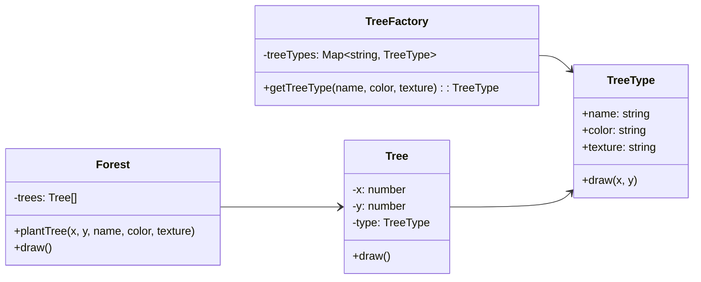

# Flyweight

## Intent

Sử dụng chia sẻ (sharing) để hỗ trợ số lượng lớn object nhỏ một cách hiệu quả về bộ nhớ.

## Motivation

Khi cần tạo hàng ngàn object (ví dụ rừng cây trong game), việc lưu trữ dữ liệu lặp lại (màu, kết cấu…) gây lãng phí. Flyweight tách dữ liệu **nội tại (intrinsic)** và **ngoại tại (extrinsic)** để tái sử dụng.

## Structure

- **Flyweight**: Interface cho các object chia sẻ.
- **Concrete Flyweight**: Cài đặt Flyweight, chứa dữ liệu nội tại có thể chia sẻ.
- **Flyweight Factory**: Đảm bảo tái sử dụng Flyweight thay vì tạo mới.
- **Context**: Lưu trữ dữ liệu ngoại tại (ví trí, trạng thái…).
- **Client**: Quản lý Context và sử dụng Flyweight.

## Participants

- `TreeType` (Flyweight)
- `TreeFactory` (Flyweight Factory)
- `Tree` (Context)
- `Forest` (Client)

## Applicability

- Khi ứng dụng cần tạo số lượng lớn object giống nhau.
- Khi chi phí lưu trữ cao do dữ liệu lặp lại.
- Khi có thể tách dữ liệu thành nội tại (shareable) và ngoại tại (context-dependent).

## Consequences

✅ Ưu điểm:

- Tiết kiệm bộ nhớ bằng cách chia sẻ dữ liệu chung.
- Quản lý hiệu quả số lượng lớn object.

⚠️ Nhược điểm:

- Tăng độ phức tạp (phải phân tách intrinsic/extrinsic).
- Cần thêm factory quản lý Flyweight.

## Sample Code

Xem file [`example.ts`](./example.ts)

## Related Patterns

- **Composite**: Thường dùng chung khi cần quản lý nhiều object trong cấu trúc cây.
- **Factory Method**: Có thể dùng để tạo và quản lý Flyweight.

## Diagram

