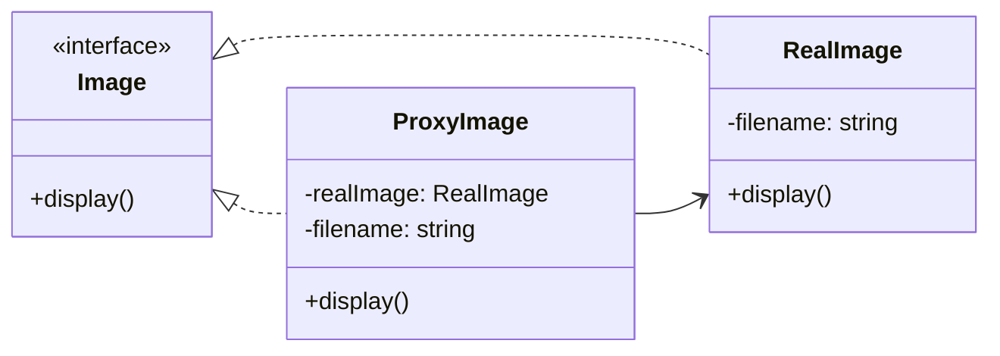

# Proxy

## Intent

Cung cấp một **đại diện (surrogate/placeholder)** để kiểm soát truy cập đến object thật (RealSubject).

## Motivation

Ví dụ hệ thống load ảnh nặng. Nếu client tạo trực tiếp `RealImage`, tốn nhiều tài nguyên. Thay vào đó, client dùng `ProxyImage`, chỉ load `RealImage` khi thật sự cần.

## Structure

- **Subject**: Interface chung cho RealSubject và Proxy.
- **RealSubject**: Class chính, thực hiện logic thật.
- **Proxy**: Đại diện, quản lý lifecycle, truy cập, lazy load, caching…
- **Client**: Làm việc với Subject interface, không biết có Proxy hay không.

## Participants

- `Image` (Subject)
- `RealImage` (RealSubject)
- `ProxyImage` (Proxy)
- `Client`

## Applicability

- Khi cần lazy loading cho object nặng.
- Khi cần caching hoặc logging khi truy cập object.
- Khi muốn bảo vệ object thật bằng cơ chế kiểm soát truy cập.

## Consequences

✅ Ưu điểm:

- Giảm chi phí khởi tạo đối tượng nặng.
- Kiểm soát chặt chẽ quyền truy cập.
- Có thể thêm logging, caching, lazy init dễ dàng.

⚠️ Nhược điểm:

- Tăng thêm class, làm thiết kế phức tạp hơn.
- Có thể làm giảm hiệu năng nếu Proxy xử lý nặng.

## Sample Code

Xem file [`example.ts`](./example.ts)

## Related Patterns

- **Decorator**: Cũng wrap object, nhưng để thêm behavior. Proxy tập trung vào kiểm soát truy cập.
- **Adapter**: Thay đổi interface, trong khi Proxy giữ nguyên interface.

## Diagram

